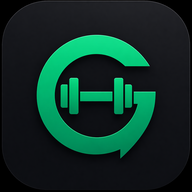

# GerakFit 💪

A mobile-first Progressive Web App (PWA) for gym tracking, built with React, TypeScript, Supabase, and Dexie.js.



## Live App

[gerak-fit.vercel.app](https://gerak-fit.vercel.app)

---

## Features

### Core
- **Auth** — Register, login, forgot password via Supabase Auth
- **Onboarding** — Goal, experience level, training schedule, equipment selection
- **Dashboard** — Weekly progress, streak tracker, recent PRs, session history
- **Dark mode** — Toggle in header, saved to localStorage

### Workout
- **Workout Logger** — Log sets, reps, weight, RPE, rest timer, warm-up sets
- **Progressive Overload Engine** — Suggests next weight based on last session performance
- **PR Detection** — Auto-detects 4 record types: heaviest weight, most reps, estimated 1RM, total volume
- **Offline-first** — Sets auto-saved to Dexie.js (IndexedDB), syncs to Supabase when online

### Programs
- **Program Builder** — Full Body, Upper/Lower, PPL, Body Part Split
- **Auto-generated** — Exercises selected based on available equipment and experience level
- **Regenerate** — Shuffle exercises while keeping the same split structure

### Exercise Library
- 78+ exercises across 9 muscle groups
- Filter by muscle group, difficulty, equipment
- Instructions and common mistakes for every exercise

### Analytics
- Volume by muscle group (bar chart)
- 7-day consistency heatmap
- 8-week session trend (line chart)
- Muscle frequency tracker — flags undertrained muscles

### Daily Challenge
- Solo Leveling-inspired rank system (E → D → C → B → S)
- Rank unlocks based on streak days
- Bodyweight only — no equipment needed
- XP system with streak tracking
- Rest timer with skip/extend controls

### Profile
- Avatar upload via Supabase Storage
- Edit goal, experience, training schedule, injury notes
- Full equipment list (80+ items across 8 categories)
- Body weight log with trend tracking

### AI Weekly Summary
- Powered by Claude API
- Analyzes weekly volume, consistency, PRs, and muscle balance
- Personalized coaching feedback in plain language

---

## Tech Stack

| Layer | Choice |
|-------|--------|
| Frontend | React + TypeScript |
| Styling | Tailwind CSS |
| Offline DB | Dexie.js (IndexedDB) |
| Backend | Supabase (Postgres + Auth + Storage) |
| Charts | Recharts |
| Deploy | Vercel |

---

## Getting Started

### Prerequisites
- Node.js 18+
- A Supabase project
- A Vercel account (for deployment)

### 1. Clone and install

```bash
git clone https://github.com/atqananwar/GerakFit.git
cd GerakFit
npm install
```

### 2. Set up Supabase

1. Create a project at [supabase.com](https://supabase.com)
2. Run `gerakfit_supabase_setup.sql` in the Supabase SQL Editor
3. Enable Email Auth in **Authentication → Providers**
4. Set Site URL to `http://localhost:5173` in **Authentication → URL Configuration**
5. Add `https://your-vercel-url.vercel.app/**` to Redirect URLs

### 3. Configure environment

Create a `.env` file in the root:

```env
VITE_SUPABASE_URL=https://xxxx.supabase.co
VITE_SUPABASE_ANON_KEY=eyJ...
```

### 4. Run locally

```bash
npm run dev
```

Open [http://localhost:5173](http://localhost:5173)

### 5. Build for production

```bash
npm run build
npm run preview
```

---

## Project Structure

```
src/
├── contexts/
│   └── AuthContext.tsx          # Auth state provider
├── lib/
│   ├── auth.ts                  # Supabase auth helpers
│   ├── db.ts                    # Dexie offline database schema
│   ├── overload.ts              # Progressive overload + PR detection engine
│   ├── programs.ts              # Program generation engine
│   ├── supabase.ts              # Supabase client
│   └── sync.ts                  # Offline sync queue processor
└── screens/
    ├── AISummaryScreen.tsx      # AI weekly coaching summary
    ├── AnalyticsScreen.tsx      # Progress charts and stats
    ├── AuthScreen.tsx           # Login, register, forgot password
    ├── DailyChallengeScreen.tsx # Bodyweight daily challenges
    ├── DashboardScreen.tsx      # Home dashboard
    ├── ExerciseLibrary.tsx      # Browse and search exercises
    ├── OnboardingScreen.tsx     # New user setup flow
    ├── ProfileScreen.tsx        # Profile, equipment, body log
    ├── ProgramBuilder.tsx       # Workout program generator
    └── WorkoutLogger.tsx        # Active workout session logger
```

---

## Database Schema

Key tables in Supabase:

- `profiles` — User profile, goal, experience, training schedule
- `user_equipment` — Equipment available at user's gym
- `exercises` — Exercise library (78+ exercises)
- `exercise_alternatives` — Alternative exercises per exercise
- `programs` — User's active workout program
- `workout_templates` — Days within a program
- `template_exercises` — Exercises within a day
- `workout_sessions` — Completed workout sessions
- `session_exercises` — Exercises logged in a session
- `exercise_sets` — Individual sets (weight, reps, RPE)
- `personal_records` — PR records per exercise
- `body_logs` — Body weight entries + daily challenge logs
- `recovery_logs` — Energy, sleep, soreness tracking

All tables protected with Row Level Security (RLS).

---

## Deployment

### Vercel (recommended)

1. Push to GitHub
2. Import repo at [vercel.com](https://vercel.com)
3. Add environment variables in Vercel project settings:
   - `VITE_SUPABASE_URL`
   - `VITE_SUPABASE_ANON_KEY`
4. Deploy

Every push to `main` triggers automatic redeployment.

---

## Security

- All user data protected with Supabase RLS policies
- Passwords: minimum 8 characters, 1 uppercase, 1 number
- API keys stored in environment variables, never committed
- HTTPS enforced via Vercel
- Avatar uploads scoped to user's own folder in Supabase Storage

---

## Roadmap

- [ ] Offline sync queue improvements
- [ ] Push notifications for rest timer
- [ ] Plate calculator
- [ ] Share PR to social media
- [ ] MealKira integration (nutrition tracking)
- [ ] Apple Watch / wearable support

---

## Built by

Atqan — [github.com/atqananwar](https://github.com/atqananwar)